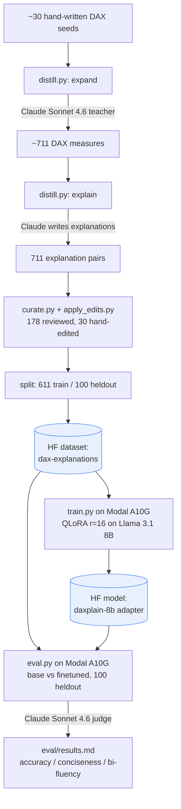

# DAXplain-8B — a finetuned DAX-to-English explainer

A complete, reproducible **QLoRA finetuning workflow**: distil a dataset with a teacher
model, curate it, train a LoRA adapter on Llama 3.1 8B, and evaluate it against the base
model with an LLM-as-judge — shipped as three linked artifacts.

| Artifact | Link |
|---|---|
| 🤖 Model (LoRA adapter) | [`AaronHuang160/daxplain-8b`](https://huggingface.co/AaronHuang160/daxplain-8b) |
| 📊 Dataset | [`AaronHuang160/dax-explanations`](https://huggingface.co/datasets/AaronHuang160/dax-explanations) |
| 💻 Code | this repo |

## What & why

DAX (the formula language behind Power BI / Tabular semantic models) is powerful but
terse. **DAXplain-8B** takes a DAX measure and explains it in plain English the way a
senior BI consultant would — *what* it computes, *how*, and one *watch-out*. It's a
narrow, BI-specific finetune that demonstrates the full modern recipe end-to-end.

## Architecture



## Results

Base **Llama 3.1 8B Instruct** vs **DAXplain-8B** on 100 held-out measures, scored by
Claude Sonnet 4.6 (blind) on a 1–5 rubric. Full table + worked examples in
[`eval/results.md`](eval/results.md).

| Metric | Base | DAXplain-8B | Δ |
|---|---|---|---|
| Accuracy | 3.11 | 2.91 | −0.20 |
| Conciseness | 2.51 | 2.17 | −0.34 |
| BI-fluency | 2.29 | **3.21** | **+0.92** |
| **Overall** | 2.64 | **2.76** | **+0.13** |

**Takeaway:** a large, on-target lift in BI-fluency/readability and a net-positive
overall score, with a small honestly-reported tradeoff in raw accuracy and conciseness —
the expected profile of a style finetune (it changes *how* the model explains, not *what*
it knows).

## Pipeline / scripts

| Script | Role |
|---|---|
| `distill.py` | Expand seeds → measures, distil explanations, split, render dataset card |
| `curate.py` | Guided human review/edit of explanations |
| `apply_edits.py`, `cleanup.py` | Apply edit batches; normalize text |
| `push_hf.py` | Publish the dataset to HF Hub |
| `train.py` | QLoRA finetune on Modal; push adapter to HF |
| `eval.py` | Base-vs-finetuned eval (Modal generate + local LLM-judge) |

## Reproduce

```bash
pip install -r requirements.txt
cp .env.example .env          # add ANTHROPIC_API_KEY + HF_TOKEN
modal token new               # authenticate Modal
modal secret create hf-token HF_TOKEN=hf_xxx

# dataset (optional — already published)
python distill.py expand --target 800 && python distill.py explain
python distill.py split --heldout 100 && python distill.py card

# train + evaluate
modal run train.py
modal run eval.py --action all --n 100
```

See [`modal_secrets.example.md`](modal_secrets.example.md) for the secret setup.

## License

Code: MIT. Model adapter: Llama 3.1 Community License. Dataset: CC-BY-4.0.

---

*Built as a finetuning-workflow demonstration: distil → curate → train → eval → publish.*
